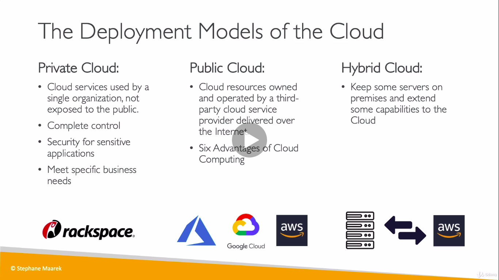
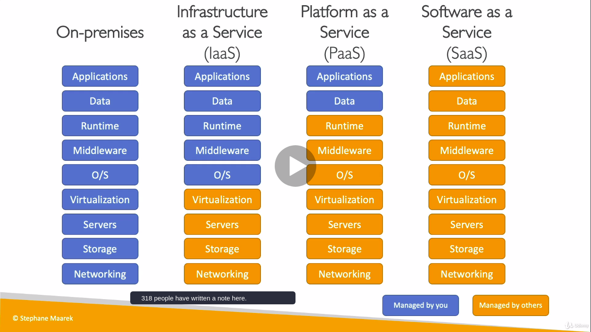
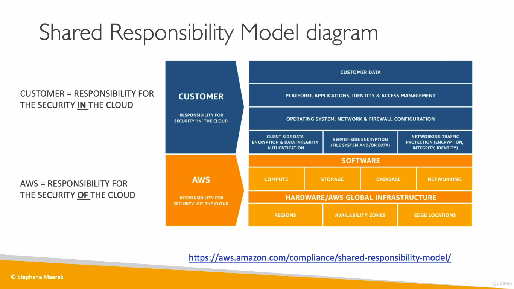
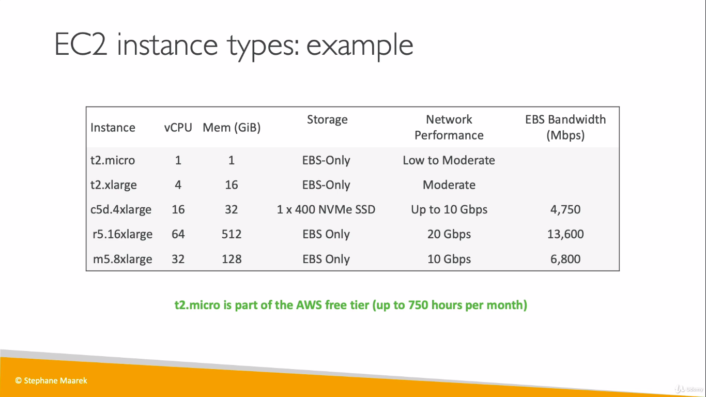
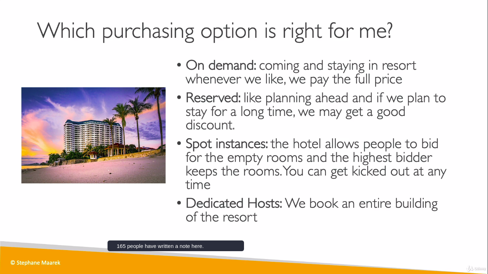
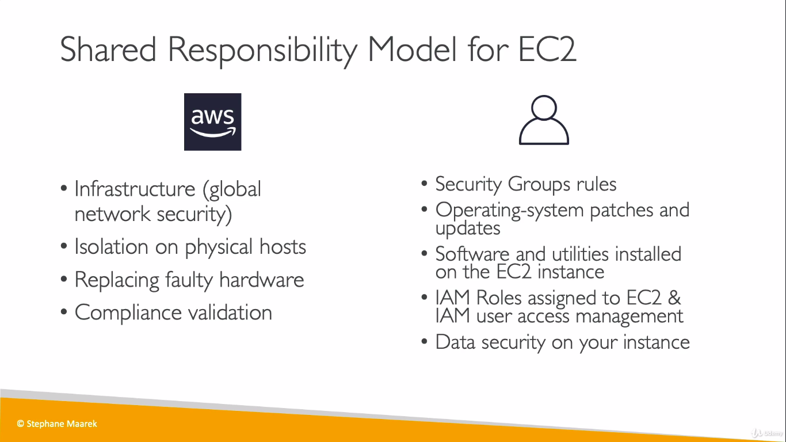
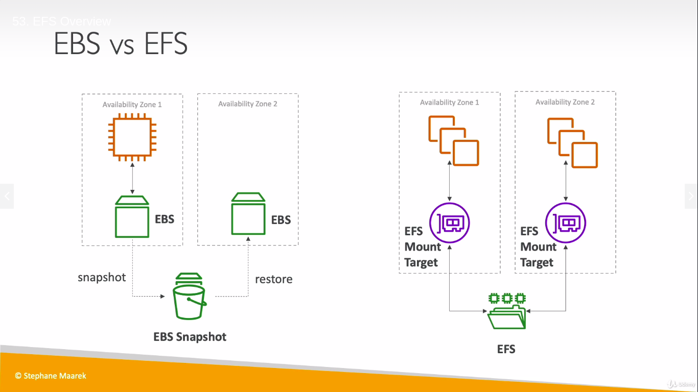
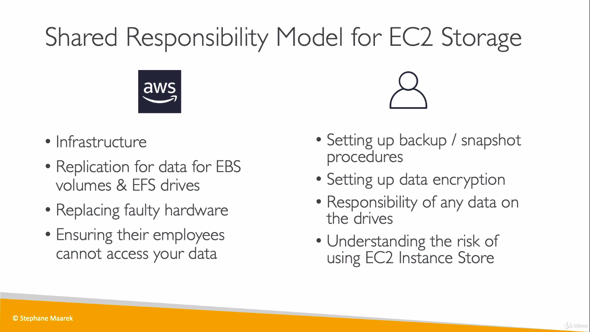

# Cloud Computing
   
 * Cloud Computing is the on-demand delivery of compute power,database storage,applications,and other IT resouces.
 * Through a cloud services platform with pay-as-you-go pricing.
 * provision of right type and size.(Bigone,smallone,ten,two for tomorrow)
 * Easy access to servers,storage,databases and set of application services.
 * Deployment models of Cloud
   

## Types of Cloud Computing

 1. Infrastucture as a Service (IaaS)
 >> Provide building blocks for cloud IT
 >> Provides networking,computers,data storage space
 >> Highest level of flexibility
 >> easy parallel with traditional on-premises 
 >> Eg:Amazon EC2,Azure,Rackapace,GCP

 2. Platform as a Service (PaaS)
 >> Removes the need for your organization to manage the underlying infrastucture
 >> Focos on the deployment and management of your applications
 >> Eg:Elastic Beanstalk (on AWS),Google App Engine(GCP)

 3. Softwrae as a Service (SaaS)
 >> Completed  product that is run and managed by the service provider
 >>Eg:Many AWS services(Rekognition for machine learning),Google Apps (Gmai,Dropbox)

   

### Pricing Fundamentals

1. Compute(pay for compute time)
2. Storage (pay for data stored in cloud)
3. Pay Data transfer OUT of the Cloud(Data Transfer IN is Free)

### AWS Global Structure

* The AWS Global infrastucture is designed and built to deliver the most flexible,reliable,scalable, and secure cloud computing environment with the highest quality global network performance available today.AWS have 230 Allowed services.www.infrastucture.aws

1. Regions -North America(Oregon,N.california,ohio ,etc),South America(sao paulo),Europe(ireland,london,spain,milan,paris,frankfurt,stockholm) and Asia pacific(baharin,mumbai,singapore,tokyo,sydney, etc).Total of 26 regions all around the world

2. Availability Zones(AZ)-Each regions have min 2 to max 6 availability Zones.AWS maintains 77 availability Zones around the world.Each AZ can be multiple data centres and at full scale have thousands of servers.AZs are seprated from one another by many km.
>>Data centres are key to AWS infrastucture need to protect from manmade and natural risks.It has four layers PERIMETER LAYER(security gurds,fencing), INFRASTUCTURE LAYER(backup,HVAC,fire safety), DATA lAYER(area holds customer data,authorised person have only access), ENVIRONMENTAL LAYER(site selection depends on flood ,weather)

3. Local Zones -its aws new deployment place near large poplation,industry and IT centres.Its an Extension of AWS region ,and can run services a)Amazon Elastic Compute Cloud, b)Amazon Virtual private cloud. c)Amazon elastic Block store, d)Amazon File storage, e)Amazon Elastic Load Balancing

4. Point of Presence(PoP)-Amazon has 216 Points of presence in 84 cities .Deliver customer content through worldwide network of PoP, consists of Edge locations and Regional Edge cache servers. Amazon Cloudfront is a fast Content Delivery Network (CDN) thar securely delivers data, videos ,application with high transfer speed.

# IAM -IDENTITY AND ACCESS MANAGEMENT

* Global service
* Root account created by default shouldn't be shared
* Users within your oraganization can be grouped
* Groups only contain users,not other groups
* User don't have to belong to a group,and user can belong to multiple groups
* @ follwed by name indicates IAM user

## IAM Roles

* EC2 instance Roles
* Lambda Function Roles
* Roles for Cloud Formation

# AMAZON EC2

* EC2 is one of the popular of AWS offering
* EC2 = Elastic Compute Cloud = Infrastucture as a Service
* its mainly consists of
  >>Renting  virtual machine (EC2)
  >>Storing data on virtual drives (EBS,elastic block store)
  >>Distributing Load across machines (ELB,elastic load balancing)
  >>Scaling the services using auto-scaling group (ASG)
* Knowing EC2 is fundamental to understand how the Cloud   works

## EC2 SiZING AND CONFIG
* operating system-Linux or Windows
* How much compute powers and core (CPU)
* How much random-access memory(RAM)
* How much storage space:
  >> Network-attached(EBS & EFS)
  >> hardware (EC2 Instance Store)
* Network card:speed of the card,Public IP address
* Firewall rules:security group
* Bootstrap script(configure at first launch):EC2 User    data 

## SECURITY GROUPS

 * Security Groups are fundamentals of network security in AWS
 * They control how traffic is allowed into or out of our EC2 instances.
 * Security groups only contain allow rules
 * Security groups rules can reference by IP or by security group

### SECURITY GROUPS -DEEPER DRIVE

* Security groups are acting as a "Firewall" on EC2 instances
* They regulate
  >> Access to Ports
  >> Authorised IP ranges -IPv4 and IPv6
  >> Contol of inbound network
  >> Control of outbound network

## CLASSIC PORTS

* 22 = SSH (Secure Shell)-login into linux instance
* 21 = FTP (File Transport Protocol)
* 22 = SFTP (Secure File Transport Protocol)
* 80 = HTTP -access unsecured websites
* 443 = HTTPS -access secured websites
* 3389 = RDP (Remote Desktop Protocol)-log into a Windows instance 

## EC2 INSTANCE PURCHASING OPTIONS

* ON-DEMAND INSTANCES(pay for what you use,has highest cost but no upfront payment,no long term commitment)

* RESERVED INSTANCES-(Minimum 1 year,75% discount as compared to on-demand,)
 >> purchasing options:no upfront=no discount,partial upfront=+ discount,all upfront=++ discount
 >> reserve a specific instance type
 1.convertible reserved instances(can change EC2 type,up to 54% of discount)
 2.scheduled reserved instances(commitment for 1-3 years,require a fraction of day/week/month, EG:every thursday between 3 and 6 pm)

* EC2 SPOT INSTANCES-90% discount as compared to on-demand,can lose at any time if your max price is less than current spot price,the most cost-efficient

* EC2 DEDICATED HOSTS-
 >>An amazon EC2 dedicated host is a physical server with EC2 instance fully dedicated to you use.
 >>Allocated for your account for a 3 year period reservation
 >> More expensive
 >> for companies that have strong regulatory or compliance needs.  

## EC2 STORAGE -EBS(ELASTIC BLOCK STORE)

* An EBS Volume is a network drive you can attach to your instances while they run.
* They can be mounted to one instance at a time.
* They are bound to a specific availability zone.
* Analogy:Think them as "network USB" stick
* Free tier: 30GB of free EBS stoarge of type gp2 per month
* EBS volume-
  >>it uses network to communicate,might be a bit of latency
  >>it can be detached from EC2 instance and attached to another one quickly.
  >>An EBS volume in us-east-1a cannot be attached to us-east-1b
  >>to move volume across you first need to snapshot it.
  >>You can increase the capacity of the drive over time
  >>you get billed for all provisional capacity(size in GBs and IOPS-input output operations per second)
### We cannot attach an EBS volume to two EC2 instances but possible us to attach two EBS volumes to one instances.

### EBS SNAPSHOTS

* Make a backup (snapshot) of your EBS volume at a point in time
* Not necessary to detach volume to do snapshot,but recommended
* Can copy snap shot across AZ or Regions

## AMI -AMAZON MACHINE IMAGE

1. AMI are customization of an EC2 instance
  >>you add you own software ,configuration,operating system ,monitoring..
  >>Faster boot/configuration time because all your software is pre-packaged
2. AMI are built for a specific region and can be copied across regions.
3. You can launch EC2 instances from :
   >>A public AMI -AWS provided
   >>Your owm AMi -You make and maintain them youself
   >>An AWS Marketplace AMI:an AMI someone else made   

## EC2 INSTANCE STORE

* EBS volumes are network drives with good but limited performance
* If you need a high-performance hardware disk,Use EC2 instance store
* Better I/O performance
* EC2 instance store lose their data if they are stopped
* Risk of data loss if hardware fails. 

## EFS-ELASTIC FILE SYSTEM

 * Managed NFS(network file system) that can be mounted on 100s of EC2
 * EFS works with Linux EC2 instances in multi AZ
 * Highly available,scalable,expensive(3xgp2),per pay use.

 
 

## ELB & ASG(ELASTIC LOAD BALANCING & AUTO SCALING GROUP)

### SCALABILITY AND HIGH AVAILABILITY

   * Scalability means that an application / system can handle greater loads by adapting.
   * There are two kinds scalability
     >>Vertical scalability-Increase instance size(=scale up/ down).From:t2.nano-0.5G of RAM,1 vcpus --TO : u-12tbl.metal-12.3TB of RAM,448 vCPUs
     >>Horizontal scalability(=elasticity)-Increase number of instances (=scale out/in).it consists of
       1.Auto Scaling Group
       2.Load Balancer

    * High availability means running application /system in at least 2 Availability Zones. 
     >>it goes hand in hand with horizontal scaling. 
     >>The goal is to survive data center loss(disaster)
     ELASTICITY-In scalable system elasticity means that there will be some "auto -scaling" so that the system can scale based on the load.This is "cloud-friendly":pay-per-use,match demand,optimize costs.

  ### ELB

     * Load balancers are servers that forward internet traffic to multiple server to multiple servers(EC2 instances)
     * Expose single point of access(DNS) to your application
     * Provide HTTPS for your websites
     * High availability zones
     * An ELB ia a managed load balancer
       1. AWS guarantees that it will be working.    
       2. AWS takes cares of upgrades,maintenance,high availability
       3. AWS provides only a few configuration knobs.
     * Its costs less but high effort on maintenance
     * 3 kinds of Load Balancer offered by AWS:
       1. Application Load Balancer(HTTP/HTTPS only)-Layer 7
       2. Network load Balnacer(ultra high performance,allows TCP)-Layer 4
       3. Classic Load Balancer-layer 4 & 7 

   ### AUTO SCALING GROUP

      * In real-life the cloud on your websites and application vcan change
      * The Goal of ASG is:
        1. Scale out(add EC2 instances) to match an increased load
        2. Scale in(remove EC2 instances) to match decreases load
        3. Ensure we have minimum and maximum number of machines running.
        4. Automatically register new instances to a load balancer.
        5. Replace unhealthy instances
      * Cost saving : only run at optimal capacity  

# AMAZON S3

 * Amazon S3 is one of the main building blocks AWS
 * Its advertised as "infinitely scaling storage"
 * Many websites use Amazon S3 as backbone
 * USES-Backup and storage,Disaster Recovery,Hybrid Cloud storage,Media Hosting,static website, Media Hosting

## BUCKETS

* S3 allows people to store objects(files) in buckets(directories)
* Buckets must have globally unique name(across all regions all accounts)
* S3 looks like a global service but buckets are created in a region
* Naming convention
 >> No uppercase
 >> No underscore
 >> 3-63 characters long
 >> Not an IP
 >> Must start with lowercase letter or number
* Max Object Size is 5TB(5000GB)
* More than 5GB ,must use "multi part upload"

## S3 SECURITY-BUCKET POLICY

* USER BASED-IAM policies are attached to IAM user to access into S3 buckets.
* RESOURCE BASED-Bucket policy,rule attached directly to the S3 buckets to allow or deny requests coming from other accounts or public requests.
* Encryption-Encrpt using encryption keys.

## S3 WEBSITES

* S3 can host static websites and have them accessible on the wwww
* Website URL will be .<bucket-name>.s3-website-AWS-region>.amazonaws.com(if you are in another region only change is that instead of dash there is a dot followed by websitee
* If you get 403(Forbidden) error,make sure the bucket policy allow public reads

## S3 VERSIONING
 
* You can version your files in Amazon S3.If we need to replace the files,update it,then it would be good to keep previous versioning of your files in amazon S3.
* It is enabled at the bucket level
* Same key overwrite will increment the "version":123....
* It is best practice to version your bucket
* S3 has ability to restore a deleted file

## S3 ACCESS LOG

* If you enable permissions to access log Any request that made to your S3 buckets from any account authorized or denied will be logged.Create a new bucket and enable access log in  properties for the parent one.Target bucket shoulb be new one.

## S3 REPLICATION

* Must create a replica bucket in another region
* Must enable Versioning in source and destination.
* CROSS REGION REPLICATION (CRR)
* SAME REGION REPICATION (SRR)
* 
## STORAGE CLASSES

* Amazon S3 Standard-General Purpose
* Amazon S3 standard-Infrequent Access(IA)
* Amazon S3 One-Zone-Infrequent Access
* Amazon S3 intelligent tiering
* Amazon Glacier
* Amazon Glacier Deep Archive
* Amazon S3 Reduced Redundancy Storage

## S3 DURABILITY AND AVAIALABILITY

* High durability(99.999999%) of object across multiple AZ
* If you store 1 crore objects with Amazon S3, you can average expect to incur a loss of a single object once every 10000 years.
* Same for all storage classes.
* AVAILABILITY:Measures how readily available a service is
* S3 standard has 99.99% availability,which means it will not be avaialable 53 minutes a year.
* varies depending on storage class

## SNOWBALL

* Physical data transport solution that helps moving TBs or PBs of data in or out of AWS
* Pay per data transfer job
* Used when large data cloud migrations,DC decommission,disaster recovery.

### SNOWBELL PROCESS

1. Request AWS console to deliver a Snowbell device.
2. Install the snowbell client on your server
3. shipback device to the AWS using right aws facility
4. Data will be loaded to S3 bucket from snowball device by amazon using import/export facility.
5. Snowball is completely wiped.
6. TYPES-SNOWBALL EDGE
  >> 100TB capacity
  >> We can add EC2 AMI to add computations to the data or processing to the data.
  >> Its very useful to pre-process the data while moving before it gets to S3.

### AWS STORAGE CLOUD OPTIONS

1. BLOCK
>>Amazon EBs
>>EC2 Instance Store
2. FILE
>>Amazon EFS
3. OBJECT
>>Amazon S3
>>Glacier

### AWS STORAGE GATEWAY

* Bridge whatever happen on-permises to AWS cloud.
* Hybrid storage service will allow on-permises system to use cloud to extend storage capability.
* It can be used for disaster recovery,backup and restore.
* Three types of storage gateway.Fileway Gateway,Volume Gateway and tape gateway.
* Storage Gateway will using Amazon EBS,Amazon S3, and Glacier(Bridge your file systems and your storage on premises into cloud)

# DATABASES AND ANALYTICS
 
* If you are storing data on disk,would be on EBS drive,an EBS volume,an EC2 instance store,Amazon S3 you have limits.if you need to store data in structure way use Database.
* Structure will allow you to build indexes, we can do per files operations.
* Database are optimized for a purpose and come with different features,shapes and constraints.

## RELATIONAL DATABASE SERVICE (RDS)

* Its managed DB(database) use SQL as a query lanuguage.
* Its allows you to create databases in cloud that are managed by AWS.
  1.Postgres
  2.MySQL
  3.MariaDB
  4.Oracle
  5.Microsoft SQL Server
  6.Aurora(AWS Proprietary database)

### ADVANTAGES OF RDS

* RDS is a managed database service,provisioning is Automatic and patching of OS os done by AWS
* Continuous backup and restore options (Point in Time restore)
* Can monitor dasboards to see database is doing good.
* Multi AZ setup for DR(Disaster Recovery)

### RDS SOLUTION ARCHITECTURE

* ELASTIC LOAD BALANCER(will take web request)-----EC2 instances(do application logic)-------AMAZON RDS(SQL,relational database)

### AMAZON AURORA

* It Supports PostgreSQL and MySQL 
* Its a AWS cloud optimized claims 5x performance improvement over MySQL on RDS and over 3x performance of postgres on RDS.
* Aurora storage automatically grows increment of 10GB up to 64 TB
* Aurora costs more than RDS(20% more)-but is more efficient.but it is not free tier.

## AMAZON ELASTICACHE

* Elasticache is to get managed by redis or memacached
* Its a memory database with high performance and low latency.
* AWS takes cares of OS maintenance / patching,optimizations,setup,configuration,monitoring,failure recovery and backups

## DYNAMODB 

* Its called serverless database.But there are servers in the backend.
* Its fully managed,highly available database with replication across 3 AZ.
* Its part of a noSQL database-not a relational database 
* DynamoDB is one of the Flagship product of AWS.
* Its great because it scales to millions of request per second ,trillions of rows and hundreds terebytes of storage.
* It has single-digit millisecond latency.
* Key/Value database and have primary key made of one or two column,partition key and sort key.In righthand side you can define your own columns of data.Finaly items going to row by row to the dynamotable

## REDSHIFT

* Based on PostgreSQL and its OLAP(online analytical processing)
* Load data every hour not every second.10x better performance than other data warehouses)
* Data is stored in columns and has an MASSIVELY PARALLEL QUERY EXECUTION (MBP engine) 
* Integarated with Business intelligence(BI) tools such as Quicksight or Tableau

## AMAZON EMR(ELASTIC MAP REDUCE)

* EMR is actually not a Database.Its to create what is called a Hadoop Cluster when you want to analyze a BIG DATA on AWS and process vast amount of data.
* Hadoop is a open source Technology that allows multiple servers to work with in a cluster.
* Hadoop Cluster is made of hundreds of EC2 instances.In Hadoop ecosystem you will see projects like Apache Spark,Hbase,Presto and Flink

## ATHENA 

* Serverless database to Perform Queries.
* Fully serverless database with SQL capabilities and its used only for query data in Amazon S3
* You dont want to pay for database but pay for every Query you run and results are going back to Amazon S3.
* DATA BASE MIGRATION SERVICE(DMS)-Quikly and securely migrate database to AWS.The source database is available during migration.

## AWS GLUE

* Its a managed extract,transform and load service(ETL).
* We use ETl service to prepare and tranform data.
* Glue ETL sits in the middle,and say we wanted to extract data from both S3 Bucket and an Amazon RDS database.So, for this, we'd use Glue to extract the data from both these sources, and then,once the data is extracted, it is in a Glue service,and we would write a script to do a transform part.So here, Glue would help us transform the data,and then, once it's transformed,we need to actually analyze it so we can load up that data into, for example, an Amazon Redshift database,where we can do our analytics the right way.And so, Glue sits here, okay?It's a very powerful tool, because you can do any kindof instruction transformationand then you can load it into many different places.