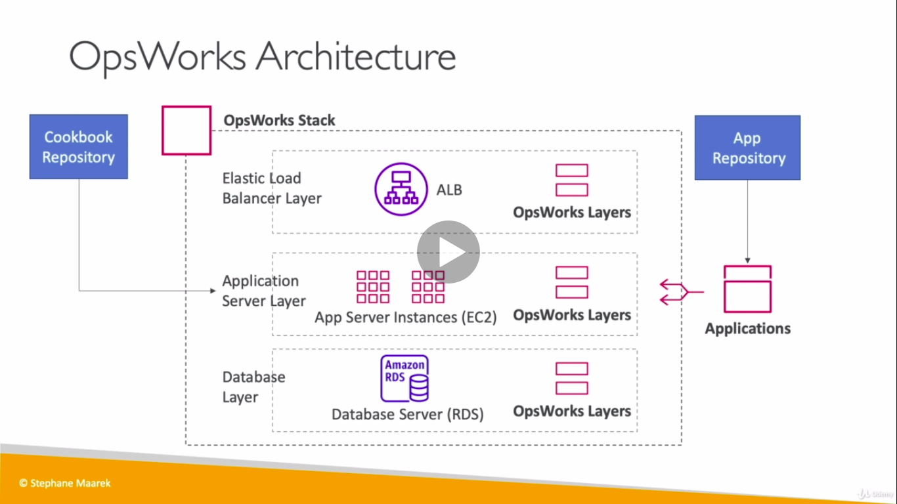
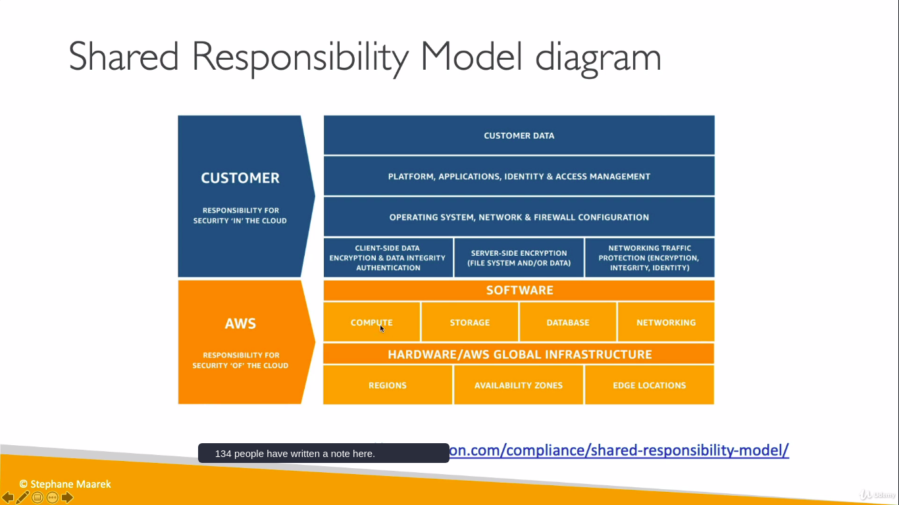
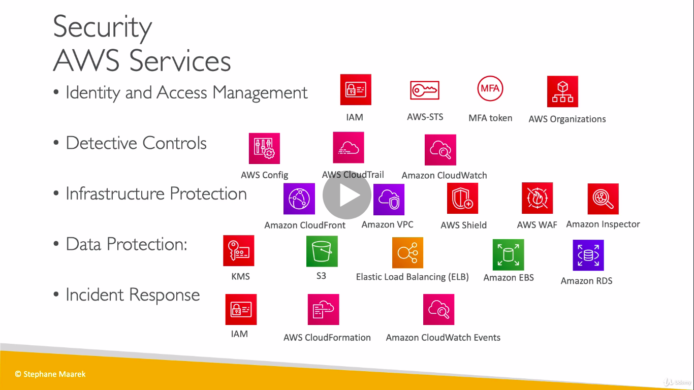
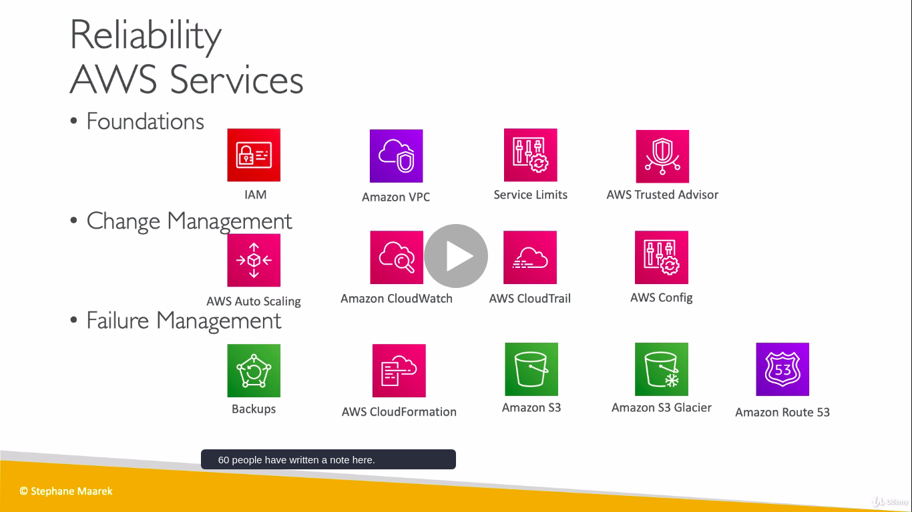
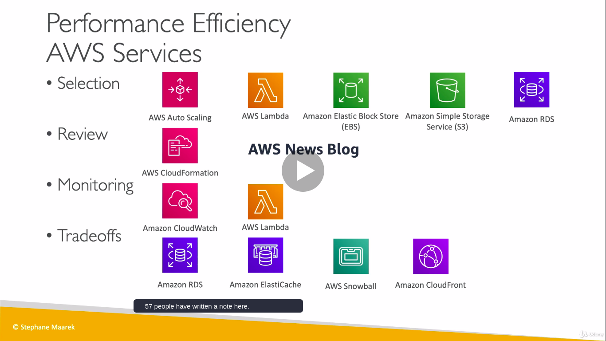
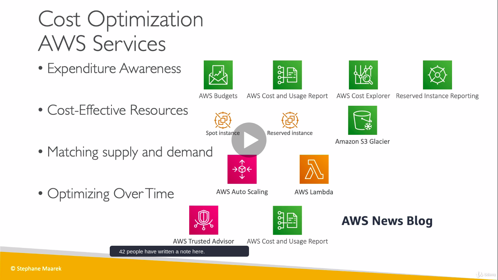

# Cloud Computing
   
 * Cloud Computing is the on-demand delivery of compute power,database storage,applications,and other IT resouces.
 * Through a cloud services platform with pay-as-you-go pricing.
 * provision of right type and size.(Bigone,smallone,ten,two for tomorrow)
 * Easy access to servers,storage,databases and set of application services.
 * Deployment models of Cloud
   

## Types of Cloud Computing

 1. Infrastucture as a Service (IaaS)
 >> Provide building blocks for cloud IT
 >> Provides networking,computers,data storage space
 >> Highest level of flexibility
 >> easy parallel with traditional on-premises 
 >> Eg:Amazon EC2,Azure,Rackapace,GCP

 2. Platform as a Service (PaaS)
 >> Removes the need for your organization to manage the underlying infrastucture
 >> Focos on the deployment and management of your applications
 >> Eg:Elastic Beanstalk (on AWS),Google App Engine(GCP)

 3. Softwrae as a Service (SaaS)
 >> Completed  product that is run and managed by the service provider
 >>Eg:Many AWS services(Rekognition for machine learning),Google Apps (Gmai,Dropbox)

   

### Pricing Fundamentals

1. Compute(pay for compute time)
2. Storage (pay for data stored in cloud)
3. Pay Data transfer OUT of the Cloud(Data Transfer IN is Free)

### AWS Global Structure

* The AWS Global infrastucture is designed and built to deliver the most flexible,reliable,scalable, and secure cloud computing environment with the highest quality global network performance available today.AWS have 230 Allowed services.www.infrastucture.aws

1. Regions -North America(Oregon,N.california,ohio ,etc),South America(sao paulo),Europe(ireland,london,spain,milan,paris,frankfurt,stockholm) and Asia pacific(baharin,mumbai,singapore,tokyo,sydney, etc).Total of 26 regions all around the world

2. Availability Zones(AZ)-Each regions have min 2 to max 6 availability Zones.AWS maintains 77 availability Zones around the world.Each AZ can be multiple data centres and at full scale have thousands of servers.AZs are seprated from one another by many km.
>>Data centres are key to AWS infrastucture need to protect from manmade and natural risks.It has four layers PERIMETER LAYER(security gurds,fencing), INFRASTUCTURE LAYER(backup,HVAC,fire safety), DATA lAYER(area holds customer data,authorised person have only access), ENVIRONMENTAL LAYER(site selection depends on flood ,weather)

3. Local Zones -its aws new deployment place near large poplation,industry and IT centres.Its an Extension of AWS region ,and can run services a)Amazon Elastic Compute Cloud, b)Amazon Virtual private cloud. c)Amazon elastic Block store, d)Amazon File storage, e)Amazon Elastic Load Balancing

4. Point of Presence(PoP)-Amazon has 216 Points of presence in 84 cities .Deliver customer content through worldwide network of PoP, consists of Edge locations and Regional Edge cache servers. Amazon Cloudfront is a fast Content Delivery Network (CDN) thar securely delivers data, videos ,application with high transfer speed.

# IAM -IDENTITY AND ACCESS MANAGEMENT

* Global service
* Root account created by default shouldn't be shared
* Users within your oraganization can be grouped
* Groups only contain users,not other groups
* User don't have to belong to a group,and user can belong to multiple groups
* @ follwed by name indicates IAM user

## IAM Roles

* EC2 instance Roles
* Lambda Function Roles
* Roles for Cloud Formation

# AMAZON EC2

* EC2 is one of the popular of AWS offering
* EC2 = Elastic Compute Cloud = Infrastucture as a Service
* its mainly consists of
  >>Renting  virtual machine (EC2)
  >>Storing data on virtual drives (EBS,elastic block store)
  >>Distributing Load across machines (ELB,elastic load balancing)
  >>Scaling the services using auto-scaling group (ASG)
* Knowing EC2 is fundamental to understand how the Cloud   works

## EC2 SiZING AND CONFIG
* operating system-Linux or Windows
* How much compute powers and core (CPU)
* How much random-access memory(RAM)
* How much storage space:
  >> Network-attached(EBS & EFS)
  >> hardware (EC2 Instance Store)
* Network card:speed of the card,Public IP address
* Firewall rules:security group
* Bootstrap script(configure at first launch):EC2 User data 

## SECURITY GROUPS

 * Security Groups are fundamentals of network security in AWS
 * They control how traffic is allowed into or out of our EC2 instances.
 * Security groups only contain allow rules
 * Security groups rules can reference by IP or by security group

### SECURITY GROUPS -DEEPER DRIVE

* Security groups are acting as a "Firewall" on EC2 instances
* They regulate
  >> Access to Ports
  >> Authorised IP ranges -IPv4 and IPv6
  >> Contol of inbound network
  >> Control of outbound network

## CLASSIC PORTS

* 22 = SSH (Secure Shell)-login into linux instance
* 21 = FTP (File Transport Protocol)
* 22 = SFTP (Secure File Transport Protocol)
* 80 = HTTP -access unsecured websites
* 443 = HTTPS -access secured websites
* 3389 = RDP (Remote Desktop Protocol)-log into a Windows instance 

## EC2 INSTANCE PURCHASING OPTIONS

* ON-DEMAND INSTANCES(pay for what you use,has highest cost but no upfront payment,no long term commitment)

* RESERVED INSTANCES-(Minimum 1 year,75% discount as compared to on-demand,)
 >> purchasing options:no upfront=no discount,partial upfront=+ discount,all upfront=++ discount
 >> reserve a specific instance type
 1.convertible reserved instances(can change EC2 type,up to 54% of discount)
 2.scheduled reserved instances(commitment for 1-3 years,require a fraction of day/week/month, EG:every thursday between 3 and 6 pm)

* EC2 SPOT INSTANCES-90% discount as compared to on-demand,can lose at any time if your max price is less than current spot price,the most cost-efficient

* EC2 DEDICATED HOSTS-
 >>An amazon EC2 dedicated host is a physical server with EC2 instance fully dedicated to you use.
 >>Allocated for your account for a 3 year period reservation
 >> More expensive
 >> for companies that have strong regulatory or compliance needs.  

## EC2 STORAGE -EBS(ELASTIC BLOCK STORE)

* An EBS Volume is a network drive you can attach to your instances while they run.
* They can be mounted to one instance at a time.
* They are bound to a specific availability zone.
* Analogy:Think them as "network USB" stick
* Free tier: 30GB of free EBS stoarge of type gp2 per month
* EBS volume-
  >>it uses network to communicate,might be a bit of latency
  >>it can be detached from EC2 instance and attached to another one quickly.
  >>An EBS volume in us-east-1a cannot be attached to us-east-1b
  >>to move volume across you first need to snapshot it.
  >>You can increase the capacity of the drive over time
  >>you get billed for all provisional capacity(size in GBs and IOPS-input output operations per second)
### We cannot attach an EBS volume to two EC2 instances but possible us to attach two EBS volumes to one instances.

### EBS SNAPSHOTS

* Make a backup (snapshot) of your EBS volume at a point in time
* Not necessary to detach volume to do snapshot,but recommended
* Can copy snap shot across AZ or Regions

## AMI -AMAZON MACHINE IMAGE

1. AMI are customization of an EC2 instance
  >>you add you own software ,configuration,operating system ,monitoring..
  >>Faster boot/configuration time because all your software is pre-packaged
2. AMI are built for a specific region and can be copied across regions.
3. You can launch EC2 instances from :
   >>A public AMI -AWS provided
   >>Your owm AMi -You make and maintain them youself
   >>An AWS Marketplace AMI:an AMI someone else made   

## EC2 INSTANCE STORE

* EBS volumes are network drives with good but limited performance
* If you need a high-performance hardware disk,Use EC2 instance store
* Better I/O performance
* EC2 instance store lose their data if they are stopped
* Risk of data loss if hardware fails. 

## EFS-ELASTIC FILE SYSTEM

 * Managed NFS(network file system) that can be mounted on 100s of EC2
 * EFS works with Linux EC2 instances in multi AZ
 * Highly available,scalable,expensive(3xgp2),per pay use.

 
 

## ELB & ASG(ELASTIC LOAD BALANCING & AUTO SCALING GROUP)

### SCALABILITY AND HIGH AVAILABILITY

   * Scalability means that an application / system can handle greater loads by adapting.
   * There are two kinds scalability
     >>Vertical scalability-Increase instance size(=scale up/ down).From:t2.nano-0.5G of RAM,1 vcpus --TO : u-12tbl.metal-12.3TB of RAM,448 vCPUs
     >>Horizontal scalability(=elasticity)-Increase number of instances (=scale out/in).it consists of
       1.Auto Scaling Group
       2.Load Balancer

    * High availability means running application /system in at least 2 Availability Zones. 
     >>it goes hand in hand with horizontal scaling. 
     >>The goal is to survive data center loss(disaster)
     ELASTICITY-In scalable system elasticity means that there will be some "auto -scaling" so that the system can scale based on the load.This is "cloud-friendly":pay-per-use,match demand,optimize costs.

  ### ELB

     * Load balancers are servers that forward internet traffic to multiple server to multiple servers(EC2 instances)
     * Expose single point of access(DNS) to your application
     * Provide HTTPS for your websites
     * High availability zones
     * An ELB ia a managed load balancer
       1. AWS guarantees that it will be working.    
       2. AWS takes cares of upgrades,maintenance,high availability
       3. AWS provides only a few configuration knobs.
     * Its costs less but high effort on maintenance
     * 3 kinds of Load Balancer offered by AWS:
       1. Application Load Balancer(HTTP/HTTPS only)-Layer 7
       2. Network load Balnacer(ultra high performance,allows TCP)-Layer 4
       3. Classic Load Balancer-layer 4 & 7 

   ### AUTO SCALING GROUP

      * In real-life the cloud on your websites and application vcan change
      * The Goal of ASG is:
        1. Scale out(add EC2 instances) to match an increased load
        2. Scale in(remove EC2 instances) to match decreases load
        3. Ensure we have minimum and maximum number of machines running.
        4. Automatically register new instances to a load balancer.
        5. Replace unhealthy instances
      * Cost saving : only run at optimal capacity  

# AMAZON S3

 * Amazon S3 is one of the main building blocks AWS
 * Its advertised as "infinitely scaling storage"
 * Many websites use Amazon S3 as backbone
 * USES-Backup and storage,Disaster Recovery,Hybrid Cloud storage,Media Hosting,static website, Media Hosting

## BUCKETS

* S3 allows people to store objects(files) in buckets(directories)
* Buckets must have globally unique name(across all regions all accounts)
* S3 looks like a global service but buckets are created in a region
* Naming convention
 >> No uppercase
 >> No underscore
 >> 3-63 characters long
 >> Not an IP
 >> Must start with lowercase letter or number
* Max Object Size is 5TB(5000GB)
* More than 5GB ,must use "multi part upload"

## S3 SECURITY-BUCKET POLICY

* USER BASED-IAM policies are attached to IAM user to access into S3 buckets.
* RESOURCE BASED-Bucket policy,rule attached directly to the S3 buckets to allow or deny requests coming from other accounts or public requests.
* Encryption-Encrpt using encryption keys.

## S3 WEBSITES

* S3 can host static websites and have them accessible on the wwww
* Website URL will be .<bucket-name>.s3-website-AWS-region>.amazonaws.com(if you are in another region only change is that instead of dash there is a dot followed by websitee
* If you get 403(Forbidden) error,make sure the bucket policy allow public reads

## S3 VERSIONING
 
* You can version your files in Amazon S3.If we need to replace the files,update it,then it would be good to keep previous versioning of your files in amazon S3.
* It is enabled at the bucket level
* Same key overwrite will increment the "version":123....
* It is best practice to version your bucket
* S3 has ability to restore a deleted file

## S3 ACCESS LOG

* If you enable permissions to access log Any request that made to your S3 buckets from any account authorized or denied will be logged.Create a new bucket and enable access log in  properties for the parent one.Target bucket shoulb be new one.

## S3 REPLICATION

* Must create a replica bucket in another region
* Must enable Versioning in source and destination.
* CROSS REGION REPLICATION (CRR)
* SAME REGION REPICATION (SRR)
* 
## STORAGE CLASSES

* Amazon S3 Standard-General Purpose
* Amazon S3 standard-Infrequent Access(IA)
* Amazon S3 One-Zone-Infrequent Access
* Amazon S3 intelligent tiering
* Amazon Glacier
* Amazon Glacier Deep Archive
* Amazon S3 Reduced Redundancy Storage

## S3 DURABILITY AND AVAIALABILITY

* High durability(99.999999%) of object across multiple AZ
* If you store 1 crore objects with Amazon S3, you can average expect to incur a loss of a single object once every 10000 years.
* Same for all storage classes.
* AVAILABILITY:Measures how readily available a service is
* S3 standard has 99.99% availability,which means it will not be avaialable 53 minutes a year.
* varies depending on storage class

## SNOWBALL

* Physical data transport solution that helps moving TBs or PBs of data in or out of AWS
* Pay per data transfer job
* Used when large data cloud migrations,DC decommission,disaster recovery.

### SNOWBALL PROCESS

1. Request AWS console to deliver a Snowbell device.
2. Install the snowbell client on your server
3. shipback device to the AWS using right aws facility
4. Data will be loaded to S3 bucket from snowball device by amazon using import/export facility.
5. Snowball is completely wiped.
6. TYPES-SNOWBALL EDGE
  >> 100TB capacity
  >> We can add EC2 AMI to add computations to the data or processing to the data.
  >> Its very useful to pre-process the data while moving before it gets to S3.

### AWS STORAGE CLOUD OPTIONS

1. BLOCK
>>Amazon EBs
>>EC2 Instance Store
2. FILE
>>Amazon EFS
3. OBJECT
>>Amazon S3
>>Glacier

### AWS STORAGE GATEWAY

* Bridge whatever happen on-permises to AWS cloud.
* Hybrid storage service will allow on-permises system to use cloud to extend storage capability.
* It can be used for disaster recovery,backup and restore.
* Three types of storage gateway.Fileway Gateway,Volume Gateway and tape gateway.
* Storage Gateway will using Amazon EBS,Amazon S3, and Glacier(Bridge your file systems and your storage on premises into cloud)

# DATABASES AND ANALYTICS
 
* If you are storing data on disk,would be on EBS drive,an EBS volume,an EC2 instance store,Amazon S3 you have limits.If you need to store data in structure way we use Database.
* Structure will allow you to build indexes, we can do per files operations.
* Database are optimized for a purpose and come with different features,shapes and constraints.

## RELATIONAL DATABASE SERVICE (RDS)

* Its managed DB(database) use SQL as a query lanuguage.
* Its allows you to create databases in cloud that are managed by AWS.
  1.Postgres
  2.MySQL
  3.MariaDB
  4.Oracle
  5.Microsoft SQL Server
  6.Aurora(AWS Proprietary database)

### ADVANTAGES OF RDS

* RDS is a managed database service,provisioning is Automatic and patching of OS done by AWS
* Continuous backup and restore options (Point in Time restore)
* Can monitor dasboards to see database is doing good.
* Multi AZ setup for DR(Disaster Recovery)

### RDS SOLUTION ARCHITECTURE

* ELASTIC LOAD BALANCER(will take web request)-----EC2 instances(do application logic)-------AMAZON RDS(SQL,relational database)

### AMAZON AURORA

* It Supports PostgreSQL and MySQL 
* Its a AWS cloud optimized claims 5x performance improvement over MySQL on RDS and over 3x performance of postgres on RDS.
* Aurora storage automatically grows increment of 10GB up to 64 TB
* Aurora costs more than RDS(20% more)-but is more efficient.but it is not free tier.

## AMAZON ELASTICACHE

* Elasticache is to get managed by redis or memacached
* Its a memory database with high performance and low latency.
* AWS takes cares of OS maintenance / patching,optimizations,setup,configuration,monitoring,failure recovery and backups

## DYNAMODB 

* Its called serverless database.But there are servers in the backend.
* Its fully managed,highly available database with replication across 3 AZ.
* Its part of a noSQL database-not a relational database 
* DynamoDB is one of the Flagship product of AWS.
* Its great because it scales to millions of request per second ,trillions of rows and hundreds terebytes of storage.
* It has single-digit millisecond latency.
* Key/Value database and have primary key made of one or two column,partition key and sort key.In righthand side you can define your own columns of data.Finaly items going to row by row to the dynamotable

## REDSHIFT

* Based on PostgreSQL and its OLAP(online analytical processing)
* Load data every hour not every second.10x better performance than other data warehouses)
* Data is stored in columns and has an MASSIVELY PARALLEL QUERY EXECUTION (MBP engine) 
* Integarated with Business intelligence(BI) tools such as Quicksight or Tableau

## AMAZON EMR(ELASTIC MAP REDUCE)

* EMR is actually not a Database.Its to create what is called a Hadoop Cluster when you want to analyze a BIG DATA on AWS and process vast amount of data.
* Hadoop is a open source Technology that allows multiple servers to work with in a cluster.
* Hadoop Cluster is made of hundreds of EC2 instances.In Hadoop ecosystem you will see projects like Apache Spark,Hbase,Presto and Flink

## ATHENA 

* Serverless database to Perform Queries.
* Fully serverless database with SQL capabilities and its used only for query data in Amazon S3
* You dont want to pay for database but pay for every Query you run and results are going back to Amazon S3.
* DATA BASE MIGRATION SERVICE(DMS)-Quikly and securely migrate database to AWS.The source database is available during migration.

## AWS GLUE

* Its a managed extract,transform and load service(ETL).
* We use ETl service to prepare and tranform data.
* Glue ETL sits in the middle,and say we wanted to extract data from both S3 Bucket and an Amazon RDS database.So, for this, we'd use Glue to extract the data from both these sources, and then,once the data is extracted, it is in a Glue service,and we would write a script to do a transform part.So here, Glue would help us transform the data,and then, once it's transformed,we need to actually analyze it so we can load up that data into, for example, an Amazon Redshift database,where we can do our analytics the right way.And so, Glue sits here, okay?It's a very powerful tool, because you can do any kindof instruction transformationand then you can load it into many different places.

# COMPUTE SERVICES(ECS,LAMBDA ,BATCH ,LIGHTSAIL) 

## DOCKER

* Docker is a software development platform to deploy apps by packaging into something called containers.
* Container is very special because it can run on any operating system,any programming language and any technology.
* we can use Amazon ECR which is a private docker repository were you can run a private docker repository.
* In docker we have infrastructure the host OS which is a EC2 instances and then DOCKER.

## ECS (ELASTIC CONTAINER SERVICE)

* Launch containers on AWS
* Its used for running docker containers.Before ECS we need to create EC2 instances
* You must provision and maintain the infrastructure yourself.AWS will take care of starting/stopping containers.
* DOCKER CONTAINER ON AWS ---ECS

## FARGATE

* Fargate is used to run docker containers on AWS
* No need to provision infrastructure(no need to create any EC2 instances).
* Serverless offering.We dont manage servers
* AWS will run containers based on specification of RAM and CPU for each container

## ECR (ELASTIC CONTAINER REGISTERY)

* Application is to run Docker images
* Private Docker registery on AWS
* This is were you store your Docker images so they can run by ECS or FARGATE

## AWS LAMBDA

* Lambda have only virtual functions only,no servers.
* Limited by Time-Whenever we need a function it will be run and we dont need a function it will not be run and we will not be billed.
* Scaling Automated.
* Pay per Request and compute time.free tier upto 1 million AWS lambda requests and 4 lakhs GBs of compute time
* Supports all programming language
* Integrated with the whole AWS suite of service
* Easy monitoring through AWS CloudWatch
* Docker is not AWS Lambda.its means ECS and FARGATE
* AWS lambda function will trigger an image from S3 and creates a thumpnail and push it back to S3 or push metatdata in DynamoDB
* Another use is to create serverless CRONJOB

## AWS BATCH

* Companies which needs to run thousands of jobs but would like to NOT manage the computer resource will use batch.
* It doesnot have time limit because it relies on EC2 instance.
* Rely on EBS/instance store for Disk Space.
* Helpful for Cost optimization focus less on Infrastructure.

## LIGHTSAIL

* With lightsail you can get servers,storage ,databases and networking on one place.
* If you're someone with little to no cloud experience then Lightsail may be a service for you.
* Low and Predictable pricing
* Simpler alternative to using EC2,RDS,ELB,EBS
* USE CASES:simple web application,Websites,

# DEPLOYMENTS

## CLOUD FORMATION(It will works only in Us virgina region)

* Cloud formation is a declarative way of outlining your AWS Infrastructure as a Code.
* Eg:If you say i want security group, I want EC2 instances that will using a security group, I want an S3 bucket, I want a load balancer.The cloud formation will automatically create all the things in right order.
* You can estimate the cost of your resources using CloudFormation template.
* Ability to destroy and re-create an infrastucture on the cloud on the fly.
* Automated generation of diagram for your templates.

##  ELASTIC BEANSTALK

* Elastic beanstalk is a developer centric view of deploying an application on AWS 
* It uses all components,EC2,ASG,ELB,RDS.But its all in one view that's easy to make sense of.
* We have full control over all configuration bit its within beanstalk.
* PLATFORM AS A SERVICE(Paas)

## AWS CODEDEPLOY

* Its a HYBRID service because its work with On-Premises and for EC2 instances.
* It deploys application automatically
* Codedeploy allows you to upgrade servers on-permises from Version 1 to Version 2

## AWS SYSTEM MANAGER(SSM)

* Hybrid service
* You can get operational insights about the state of infrastructure.
* Important feature is that you can get Automotive patching of all your servers and instances.

## AWS OPSWORKS

* CHEF AND PUPPET are two tools that are not created by AWS and these tools help you to perform  server configuration automatically.

 
 

# GLOBAL  INFRASTRUCTURE

* A global application is an application deployed in multiple regions.
* On AWS  this could be Regions or Edge locations
* DECREASED LATENCY:It take more time for a packet from asia to reach US.Deploy your application closer to your user decrease latency.
* DISASTER RECOVERY:If an AWS regions goes down (earthquake,storms,power shutdown).You can fail over to another region an application is still working
* ATTACK PROTECTION FROM HACKERS:If you have application across multiple regions and distributed globally its much harder for a attacker  to attack all this locations.
* POINT OF PRESENCE also called us EDGE LOCATIONS

## AMAZON ROUTE 53

* Route 53 is a managed DNS(Domain Name System)
* DNS-Its a collection of rules and records which help clients to find right servers through URLs

 1. Mapping www.google.com to an IPv4 its called A RECORD
 2. Mapping www.google.com to an IPv6 its called QUADRUPLE A RECORD
 3. Mapping a hostname to another hostname  its called CNAME
 4. Mapping a hostname to AWS Resource its calles ALIAS RECORD

 ### ROUTING POLICIES

 1. SIMPLE ROUTING POLICY- No healthchecks,Our browser will go into our DNS system does a DNS query and get IPv4 for as result.
 2. WEIGHTED ROUTING POLICY-Allows to distribute traffic across multiple instances,we assign weight to instances Eg:70,20,10 means 70% traffic to first one ,20% traffic to next one,10% traffic to third one.We have Health checks.
 3. LATENCY ROUTING POLICY- If user is located in America they wiil be redirected to talk a server near America and user is in australia and will be redirected to talk to Australian server.
 4. FAILOVER ROUTING POLICY: Our DNS system will do Health check on primary and if primary fails will be redirected to the Failovers.

 ## AWS CLOUDFRONT

 * Cloudfront is a  CONTENT DELIVERY NETWORK(CDN)
 * IT improves read performance by caching the content of your website at different edge locations.
 * Cloudfront is made of 216 Pop Globally
 * DDos protection(Its a kind of attack where all your servers around world are attacked at the same time )
 * So using CloudFront,content of our S3 bucket in one region can be distributed all around the world through the edge locations or Points of Presence.

 ## CLOUDFRONT vs S3 REPLICATION

 * Cloudfront will use Global Edge Network,about 216 point of presence files are cached in Edge locations may be available all around world.
 * Whereas S3 Cross Region Replication is to really replicate an entire bucket into another region.

 ## AWS GLOBAL ACCELERATOR

* Global accelerator is an AWS global network to make your requests go faster and go through the internal AWSnetwork Globally.
* Eg;If you need to tranfer S3 bucket globally we use S3 TRANSFER ACCELERATOR.If yo need to transfer afile from USA to Australia Our file is being uploaded from the United State and transfer to a bucket in Australia.And so what we'll do is we'll upload the file into a edge location very close to a user in the USA and then using the internal network,the edge location will transfer the file to the S3 Buckets in Australia and is more reliable and fast connection.

# CLOUD INTEGRATIONS

* When we have multiple applications at some point they will have to communicate with one another.There are two types of communication pattern-

1. Synchronous communication(application to application Eg:Buying Service To shipping service)
2. Asynchonous/ Event based(Eg;Buying Service-Queue-Shipping Service)

## AMAZON SQS(SIMPLE QUEUE SERVICE)

* It allows to decouple the Application.Its fully managed and its a serverless service
* Scales from 1 message per second to 10,000s per second
* Default retention of messages upto 4 days.
* Messages are deleted after they read by Consumers.
* SQS Queue is also called Fan-out-pattern
## AMAZON SNS (SIMPLE NOTIFICATION SERVICE)

* Notification Service AWS
* Pub/Sub integration which has an SNS topic.
* Event publishers" will send messages to one SNS topic And you can have as many "event subscribers who want to listen to the SNS topic notifications.Each subscriber will receive messages
* No message Retention

# CLOUD MONITORING

## CLOUD WATCH METRICES AND CLOUD ALARM

* CloudWatch provides metrics for every services in AWS
* Metric is a Variable to Monitor(CPUUtilization)
* Metrics have timestamps
* you can create CloudWatch dashboard of metrics

## CLOUDWATCH ALARMS

* Alarms are used to Trigger notification that means once a metric goes above threshhold then we can have a CloudWatch Alarm action
* Alarm actions-
1. Auto scaling(increase or decrease Ec2 instances)
2. EC2 Actions: stop,terminate,reboot or recover EC2 instances
3. Billing Alarm

## CLOUDWATCH LOGS

* Using cloudwatch logs we can collect log files from
 >>Elastic Beanstalk
 >>ECS
 >>AWS Lambda
 >>CloudTrail
 >>CloudWatch loGs agents
 >>Route53

### CLOUDWATCH LOGS FOR EC2 INSTANCES

In case of EC2 instanses will not send any log files to cloudwatch logs .For this you need to create CloudWatchLog Agent on your EC2 instances and they will push the Log files that you want to CloudWatch Log service

## CLOUDWATCH EVENTS/EVENTBRIDGE

* Its a way of react to events happening within AWS.Creating a Rule that Triggers on an Event
* You can configure the following AWS services as targets for CloudWatch Events:
  >> Amazon EC2 instances
  >> AWS Lambda functions
  >>Amazon SNS topics
  >>Amazon SQS queues
  
## AWS CLOUDTRAIL(To Record API Calls Within Your Account)

* Provides governance,compliance and audit for your account.Its enabled by Default
* Can get history of events/API calls made with AWS account
* Can put logs from Cloudtrail into Cloudwatch logs or S3

## AWS X-RAY

* Debugging Production.Using AWS X-RAY we are able to trace and get visual analysis of your application
* Troubleshooting performance

## SERVICE HEALTH DASHBOARD

* Show all regions and all services.
* It will show you as well historical information of each day,can see the current status as of today in each region,the sevices are working or not.

## PERSONAL HEALTH DASHBOARD

* It will gave you alerts and remedial guidance of our AWS service.
* It gaves you personalized view into the performance availability of the AWS service

# VPC AND NETWORKING

## VPC,SUBNET,INTERNET GATEWAY AND NAT GATEWAYS

* VPC-VIRTUAL PRIVATE CLOUD-Its private network to deploy your resources.Eg:Ec2 instances a VPC is linked to a specific regions in AWS and you have multiple VPC.

* SUBNET- It allows you to partition your network inside your VPC.Its a Range of IP addresses in your VPC

* PUBLIC SUBNET- is a subnet that is accessible from the internet.

* PRIVATE SUBNET-private subnet is a subnet that is not accessible from the internet.
* To access internet between subnets use Route Tables

### INTERNET GATEWAY AND NAT GATEWAYS

>> Internet Gateway helps our VPC instances connect with the internet.Public subnet have a route to internet gateway
>> NAT Gateways(AWS-MANAGED) and NAT instances(self-managed) allow your instances in your private subnets to access the internet while remaiing private.

## NETWORK ACL AND SECURITY GROUP(SECURITY GROUP-EC2 INSTANCE LEVEL,NETWORK ACL-SUBNET LEVEL)

* First line defense for our EC2 instance, is a NACL or network ACL, which is a Firewall that is controlling traffic from and to the Subnets
>>It can allow and Deny Rules
>>Rules only include IP address
>>Its called Statefulness.
* The Second line of Defence are Security Groups, and is a Firewall controls Traffic from to and from ENI(Elastic Network Interface)
>>It can only allow rules
>>Its Stateless

## VPC FLOW LOGS 

* VPC Flow logs are log of all the IP traffic going through your interfaces.
1. VPC Flow logs 
2. Subnet Flow Logs
3. Elastic Network Interface Flow Log
* By Enabling Flow logs we can monitor and troubleshoot for connectivity issues.

## VPC PEERING

* Connect two VPC,privately using AWS network (Eg: VPC A and VPC B)
* Make sure that there IP addresses range do not overlap.

## VPC ENDPOINTS

* Using VPC Endpoints we connect to the services using AWS network instead of public internet network
* This gives you enhanced security and Lower latency to access AWS service

TYPES OF ENDPOINTS
1. Gateway-S3 & DynamoDB
2. Interface-for all other services

## SITE TO SITE VPN & DIRECT CONNECT

* Connect an on-permises VPN to AWS.It Goes over Public Internet. 
* The connection is automatically encrypted.
ON-PERMISES(must use a Customer Gateway-CGW)
AWS(must use a Virtual private Gateway-VGW)

## DIRECT CONNECT(DX)

* Establish physical connection between on-premises and AWS
* The connection is private,secure and Fast 
* Goes over a private network
* Take a month to establish

## TRANSIT GATEWAY

* To have a Peering Connection between THOUSANDS of VPC and your on-premises system with hub and spoke star connection.
* One Single gateway to provide this Functionality

# SECURITY AND COMPLIANCE

## DDOS* PROTECTION

1. AWS SHIELD STANDARD-Protect against DDOS attack for your website and applications for all customers at no additional costs.
2. AWS SHIELD ADVANCED-24/7 premium DDoS protection
3. AWS WAF-(WEB APPLICATION FIREWALL)-Protects your web application from web exploits(layer 7-HTTP).Define WEB ACL

## PENETRATION TESTING

* AWS customers are welcome to carry out security assessments or penetration tests against their AWS infrastucture without prior approval for 8 services.

## AWS KMS(Key Management Service)

* If you hear Encryption in a service of AWS its likely to be KMS.Encryption Automatically enabled.For some services encryption is automatically enabled for some require encryption to be opted in

* TYPES OF KMS KEYS

>> CUSTOMER MANAGER CMK-You can create manage and use keys.
>>AWS MANAGED CMK-Used nad managed by AWS
>> CLOUD HSM(HARDWARE SECURITY MODULE)-Keys generated From your own CloudHSM hardware device

## AWS SECRETS MANAGER

* Newer service to store secrets.The secrets are going to encrypted using KMS

## AWS ARTIFACT

* Provides customer with on demand access to AWS Documentation and Agreement

## AMAZON GUARDDUTY

* Intelligent threat discovery to protect AWS Account and Uses Machine Learning algorithms.]

## AMAZON INSPECTOR

* Automated Security Assessments for EC2 instances  and analyse vulnerabilities and unintended network accessibility

## AWS CONFIG

* Helps to record configuration and changes over time

## AMAZON MACIE

* Macie in the instance, will be used to find the sensitive data in your S3 buckets,sensitive data such as personally identifiable information(PII)

# MACHINE LEARNING

1. REKOGNITION-Used for Face Detection,labeling,Celebrity recognition
2. TRANSCRIBE-Audio to Text(ex:Subtitles)
3. POLLY-Text to Audio
4. TRANSLATE-language Translation(Help international users to translate large volumes of Text)
5. AMAZON LEX-Amazon Lex Gives you AUTOMATIC SPEECH RCOGNITION(ASR).Helps you to bulid CHATBOTS and CALL CENTER BOTS
6. AMAZON CONNECT-Whenever you want to connect our phonecall with our infrastructure we need to use Amazon Connect.
7. COMPREHEND-Its for Natural Language Processing(NLP)
8. AMAZON SAGEMAKER-Fully managed service for developers and Data scientists to build ML models.

# ACCOUNT MANAGEMENT,BILLING & SUPPORT

## AWS ORGANIZATIONS

1. By Creating an organization you are able to manage multiple AWS accounts.The main account is going to be called Master Account and the other one is called Child    Account
2. Single payment Methord for all accounts.

## PRICING MODELS IN CLOUD 

* Aws has 4 Pricing Models.
  1. Pay as you go
  2. Save When you reserve
  3. Pay less by using more
  4. Pay less as AWS grows
* For EC2 you have minimum billing of 60 seconds and you want to pay per second for Linux and per hour for windows
* LAMBDA(pay per call,pay per duration)
* S3-(object size,number and  type of requests,S3 transfer acceleration,data transfer OUt of the S3 region)
* RDS-per hour billing,database characteristic(engine,size,memory class),Purchase type(on-demand,reserved instances)

## AWS TOTAL COST OF OWNERSHIP(TCO) CALCULATORS

* Will provide reports that can used in Executive Presentation
* We are going to compare the cost of running your applications and workloads on premises or in the traditional environment, compared to AWS on four categories,the    servers, the storage, the network,and the IT labor.

## SUMMARY

* Estimating costs in the Cloud
1. TCO Calculator
2. Simple monthly Calculator/Pricing Calculator
* Tracking costs in the Cloud
1. Billing Dashboard
2. Cost Allocation Tags-To group together Resources
3. Cost and Usage reports-will gave a detailed bill in CSV format
4. Cost Explorer-Shows cost in graph and saving plan recommendations to save costs in future.

## TRUSTED ADVISOR

* Fully Trusted Advisory can available for Business & Enterprise support plans,cloudwatch Alarms
* If you need high level account assessment from AWS to analyse your accounts and provide recommendations.It will analyze in five categories
  1. Cost Optimization
  2. Performance
  3. Security
  4. Fault Tolerance
  5. service Limits

## ADVANCED IDENTITY

1. COGNITO-Its way to provide identity for your WEB and Mobile Application users.
2. AWS DIRECTORY SERVICES:Create your own active directory service in AWS and manages User Locally.
>> AD Connector-that will redirected to the on-premise Active Directory
3. AWS SINGLE SIGN-ON (SSO)-Centrally managed Single Sign On to access multiple accounts and 3rd party business .So the idea here is that Single Sign-On allows you to 
log in once and then be connected to a bunch of applications accounts without having to re-login.

# AWS ARCHITECTING & ECOSYSTEM

1. SCALABILITY-Vertical & Horizontal
2. DISPOSABLE RESOURCES-Can easily Create and remove resources
3. AUTOMATION- Serverless,Infrastructure as a service,Auto Scaling
4. LOOSE COUPLING
5. SERVICES NOT SERVERS

## FIRST PILLAR(OPERATIONAL EXCELLENCE)

PREPARE---OPERATE--EVOLVE

* CLOUD FORMATION IS KEY TO OPERATIONAL EXCELLENCE
* Ability to run and monitor systems to deliver business values and continously improve supporting process and  procedures 
  >> Perform operations as code
  >> Documents should be Annotated
  >> Refine operations Frequently

## SECOND PILLAR (SECURITY)

* Ability to  protect information,system and assets while delivering business value through risk assesments and mitigation strategies

## THIRD PILLER (RELIABILITY)

* Ability of a system to recover from infrastructure or service disruptions, dynamically acquire computing resources to meet demand and reduce misconfiguration or network issues

## FOURTH PILLER(PERFORMANCE EFFICIENCY)

*  To use resources efficiently to meet system requirements and to maintain efficiency as demand changes and technologies evolve .Go global in minutes.

## FIFTH PILLER (COST OPTIMIZATION)

* Includes ability to run system to deliver business value at the lowest price point

# AWS MARKETPLACE

* The AWS Marketplace enables qualified partners to market and sell their software to AWS Customers. AWS Marketplace is an online software store that helps customers find, buy, and immediately start using the software and services that run on AWS.AWS Marketplace is designed for Independent Software Vendors (ISVs), Value-Added Resellers (VARs), and Systems Integrators (SIs) who have software products they want to offer to customers in the cloud. Partners use AWS Marketplace to be up and running in days and offer their software products to customers around the world.